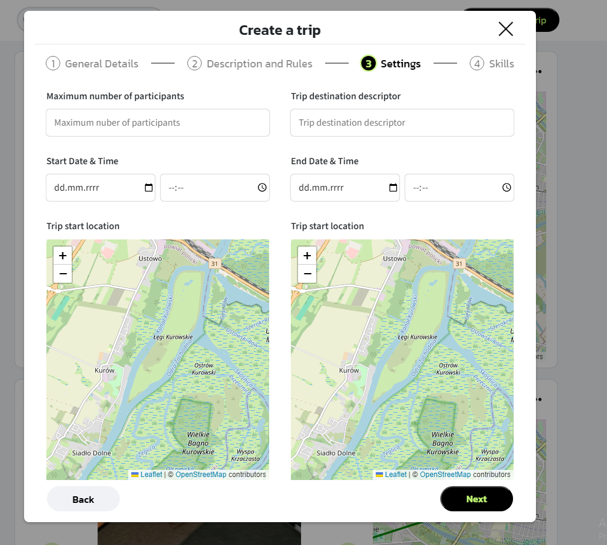

<p align="center">
   
</p>

## Cel Projektu

Celem projektu było opracowanie zaawansowanego portalu społecznościowego, który integruje funkcje organizowania podróży z możliwością dzielenia się relacjami z wyjazdów. Portal łączy funkcjonalności aplikacji typu social media z narzędziami do planowania i realizacji podróży. Projekt obejmował stworzenie dwóch aplikacji:

- [**Aplikacja mobilna**]([https://github.com/Lehito15/SocialTripper_Mobile])
- - **Aplikacja webowa**

Obie aplikacje współpracują z bazami danych, które przechowują informacje o użytkownikach, wydarzeniach i materiałach multimedialnych. System wspiera użytkowników w organizowaniu wyjazdów oraz budowaniu społeczności wokół wspólnych pasji. Oferuje także system rekomendacji, który na podstawie preferencji użytkowników sugeruje interesujące wyjazdy oraz osoby o podobnych zainteresowaniach.

## Aplikacja Webowa: Social Tripper

### Opis Funkcjonalności

Aplikacja webowa, przeznaczona na róznego rodzaju przeglądarki internetowe, stanowi portalspołecznościowy, realizując następujące funkcje:

1. **Standardowe Funkcjonalności Social Media**:

   - Przeglądanie postów, wypraw, relacji i grup.
   - Tworzenie postów, wypraw, relacji i grup
   - Aplikowanie do wydarzeń i grup.
   - Logowanie i rejestracja użytkowników z wykorzystaniem AWS Amplify.
   - Interakcja z treściami (komenowanie i reagowanie)

2. **Interfejs Mapy**:
   - Możliwość przeglądania i planowania tras podróży.

### Link do strony www

Aplikacja dostępna jest pod poniższym linkiekm: [Strona](http://socialtripper-cna3btdnckbpazd8.polandcentral-01.azurewebsites.net/)

## Instrukcja Kompilacji

Aby skompilować aplikację webową, należy n wykonać następujące kroki:

### Kompilacja lokalna na porcie 3000:

```bash
npm install
npm start
```

### Wymagane Komponenty:

- **AWS Amplify**: Szczegóły konfiguracji dostępne są [tutaj](https://docs.amplify.aws/gen1/flutter/start/project-setup/prerequisites/).
- **Backend**: Kod dostępny w repozytorium [SocialTripper_Backend](https://github.com/Lehito15/SocialTripper_Backend).
-

### Modyfikacja Odnośników w Kodzie

Aby podłączyć aplikację do działającego backendu t, należy:

1. W pliku `src/index.js` ustawić wartość `restLink` na odpowiedni adres backendu.
2. W pliku `src/Utils/helper.js` ustawić wartość `baseUrl` na odpowiedni adres backendu.
3. W pliku `src/AuthWrapper.jsx` ustawić wartość `response` na odpowiedni adres backendu

## Demonstracja Działania Aplikacji

1. **Strona główna**:
   - Widok ogólny, przeglądanie postów.

<table>
  <tr>
  <td align="center"><br><b>Widok Wydarzenia (Ogólny)</b></td>
  </tr>
</table>

2. **Widok wydarzeń**:
   - Przeglądanie wydarzeń.

<table>
  <tr>
  <td align="center"><br><b>Widok relacji</b></td> 
  </tr>
</table>

3. **Widok relacji**:
   - Przeglądanie wydarzeń

<table>
  <tr>
    <td align="center"><br><b>Tworzenie wydarzenia</b></td> 
  </tr>
</table>

4. ## **Tworzenie wydarzenia**:

<table>
  <tr>
<!--     <td align="center"><br><b>Tworzenie wydarzenia</b></td> -->
  </tr>
</table>

## Instrukcja Użytkowania

Szczegółowe informacje na temat obsługi aplikacji mobilnej oraz dostępnych funkcjonalności znajdują się w [instrukcji użytkownika](link_do_instrukcji).
